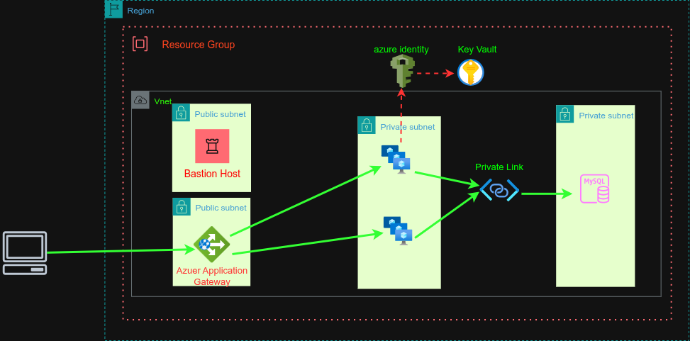

# Azure 3-Tier Application Deployment using Terraform

## 📘 Overview

This project demonstrates a **production-ready, automated deployment** of a **3-tier Node.js web application** on **Microsoft Azure**, using **Terraform** for Infrastructure as Code (IaC).

The architecture provisions a complete cloud environment — including **networking**, **security**, **compute (VM Scale Set)**, **managed database (MySQL Flexible Server)**, **Key Vault**, and **Bastion host** for secure access.

As a **DevOps Engineer**, the goal of this setup is to:

- Implement **scalable, secure, and automated infrastructure** for a modern cloud application.
- Follow **Azure best practices** for network isolation, identity-based access, and secret management.
- Demonstrate **CI/CD readiness** by separating infrastructure provisioning from app deployment logic.

---

## 🏗️ Architecture Diagram



---

## 🧱 Infrastructure Components

### **1. Resource Group**

All resources are deployed within:

```
my3tierapp-rg-multi-vm (Location: UK South)
```

---

### **2. Networking**

- **VNet:** `my3tier-vnet` (CIDR: 10.0.0.0/16)
- **Subnets:**

  - `alb-subnet` → Load Balancer Frontend
  - `backend-subnet` → VM Scale Set (App tier)
  - `db-subnet` → Delegated to MySQL Flexible Server
  - `AzureBastionSubnet` → Bastion host for SSH access

- **Private DNS Zone:** `privatelink.mysql.database.azure.com`

  - Enables private connectivity between VMSS and MySQL Flexible Server.

---

### **3. Security**

- **Network Security Group (NSG):**

  - Allows HTTP (port 3000) traffic from Load Balancer.
  - Allows SSH (port 22) only from Bastion subnet.
  - Denies all inbound Internet traffic to backend subnet.

- **Azure Key Vault:**

  - Stores application secrets in JSON format (e.g., DB credentials).
  - Access controlled via a **User-Assigned Managed Identity** attached to VMSS.
  - Secrets can be retrieved by VM instances securely using Azure SDK or environment variables.

---

### **4. Compute Layer**

- **VM Scale Set (VMSS):** `backend-vmss`

  - Ubuntu 20.04 LTS
  - 2 instances (`Standard_B1ms`)
  - Managed Identity enabled
  - Auto-updates enabled (`upgrade_mode = "Automatic"`)
  - Provisioned via Terraform with full bootstrapping

- **Custom Data Script (cloud-init):**

  - Updates system packages
  - Installs Node.js 20.x, PM2, Git, MySQL Client
  - Clones Node.js app from GitHub:

    ```
    https://github.com/ShamailAbbas/azure-3tier-app
    ```

  - Sets up `.env` file pointing to Azure Key Vault
  - Starts backend service with PM2 and enables auto-start on reboot

**Autoscale based on 70% CPU utilization:**

| Purpose                      | Detail                                                       |
| ---------------------------- | ------------------------------------------------------------ |
| **Minimum = 2, Maximum = 5** | VMSS will always have at least 2 VMs and can scale up to 5   |
| **Scale out at 70% CPU**     | If average CPU > 70% for 5 minutes → add 1 VM                |
| **Scale in at 30% CPU**      | If CPU < 30% for 10 minutes → remove 1 VM                    |
| **Cooldown**                 | Prevents rapid scaling up/down by enforcing a waiting period |
| **Metric Source**            | Uses the built-in `Percentage CPU` metric from Azure Monitor |

---

### **5. Load Balancer**

- **Azure Application Gateway**

  - Public frontend IP for app access
  - Health probe on port `3000`
  - Backend pool connected to VMSS
  - Rule to forward `TCP/80` traffic to backend instances

---

### **6. Database Layer**

- **Azure MySQL Flexible Server**

  - Version: `8.0.21`
  - SKU: `GP_Standard_D2ds_v4`
  - Private access only (via delegated subnet)
  - Automatically linked to Private DNS Zone
  - Database: `mydb`
  - Credentials stored securely in Key Vault

---

### **7. Azure Bastion**

- Securely SSH into VMSS instances without public IPs.
- Deployed in dedicated subnet `AzureBastionSubnet`.
- Accessible directly from Azure Portal:

  ```
  VMSS → Connect → Bastion
  ```

---

## 🔐 Key Vault Secret Format

The secret is stored in JSON format as:

```json
{
  "DB_HOST": "my3tier-db-xxxxxx.mysql.database.azure.com",
  "DB_USER": "mysqladmin",
  "DB_PASSWORD": "MyStrongPassword123!",
  "DB_NAME": "mydb"
}
```

VMSS instances access this secret using their **Managed Identity** and Azure SDKs (or CLI).

---

## 🧰 Prerequisites

- Terraform ≥ 1.6
- Azure CLI authenticated (`az login`)
- Git installed
- SSH client for private key usage
- Public repository of Node.js app accessible (configured in custom_data)

---

## ⚙️ Deployment Steps

### **1. Clone this repository**

```bash
git clone https://github.com/ShamailAbbas/azure-3tier-infra.git
cd azure-3tier-infra/infra
```

### **2. Initialize Terraform**

```bash
terraform init
```

### **3. Validate configuration**

```bash
terraform validate
```

### **4. Apply infrastructure**

```bash
terraform apply -auto-approve
```

---

## 📤 Outputs

After successful deployment, Terraform will display:

| Output Name            | Description                     | Example                                      |
| ---------------------- | ------------------------------- | -------------------------------------------- |
| `backend_lb_public_ip` | Public IP to access backend API | `52.160.22.14`                               |
| `mysql_fqdn`           | MySQL Private FQDN              | `my3tier-db-abc123.mysql.database.azure.com` |
| `bastion_instructions` | SSH Access Instructions         | Use Azure Bastion                            |

---

## 🔍 Accessing the App

Once deployed:

1. Open your browser and navigate to:

   ```
   http://<backend_lb_public_ip>:3000
   ```

2. The Node.js backend should respond if the app is correctly initialized.

---

## 🛠️ SSH Access (via Bastion)

1. Go to **Azure Portal → VM Scale Set → Instances → Connect → Bastion**
2. Use username: `azureuser`
3. Private key: `ssh_private_key.pem` (auto-generated in your Terraform working directory)
4. No public IP exposure — secure access through Azure Bastion only.

---

## 📦 Clean Up

To destroy all provisioned resources:

```bash
terraform destroy -auto-approve
```

---

## 🧠 Key Highlights (as a DevOps Engineer)

| Aspect            | Implementation                                  |
| ----------------- | ----------------------------------------------- |
| **IaC**           | Terraform modular, idempotent provisioning      |
| **Security**      | NSG + Bastion + Managed Identity + Key Vault    |
| **Scalability**   | VM Scale Set with Load Balancer                 |
| **Automation**    | Cloud-init for app bootstrapping                |
| **Networking**    | Private subnets, DNS zone linking               |
| **Resilience**    | Auto-healing VMSS, soft-delete in Key Vault     |
| **Best Practice** | No public IP on backend; least privilege access |

---

## 🧩 Future Enhancements

- Integrate CI/CD pipeline using **GitHub Actions** or **Azure DevOps**.
- Add **Azure Monitor** and **Application Insights** for observability.
- Implement **auto-scaling policies** for VMSS based on CPU usage.
- Extend architecture to a full **3-tier setup** with a front-end web tier (e.g., Azure App Service or Static Web App).

---

## 👨‍💻 Author

**Shamail Abbas**
DevOps Engineer | Cloud & Infrastructure Automation Specialist
🔗 [GitHub](https://github.com/ShamailAbbas) • 🌐 Azure | Terraform | Kubernetes | DevSecOps
